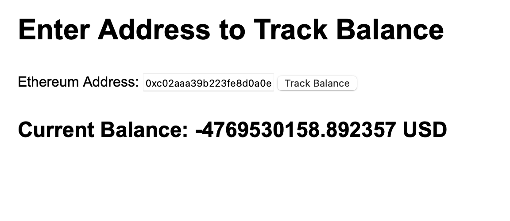

# Real Time Balance for an address

This project provides with an option to monitor, the real time balance of an address using wss-socket, subscription and Balance Updates query. For this example we are using this address - `0xc02aaa39b223fe8d0a0e5c4f27ead9083c756cc2`

## Query/ Subscription

For this project we will use a query to get the current balnce and a subscription to stream any real time balance update, both of which are listed below.

### Query:

``` graphql

{
  EVM(dataset: combined, network: eth) {
    BalanceUpdates(
      where: {BalanceUpdate: {Address: {is: "0x3fc91a3afd70395cd496c647d5a6cc9d4b2b7fad"}}}
    ) {
      sum(of: BalanceUpdate_Amount)
    }
  }
}

```

### Subscription:

``` graphgl

subscription {
  EVM{
    BalanceUpdates(
      where: {BalanceUpdate: {Address: {is: "0xc02aaa39b223fe8d0a0e5c4f27ead9083c756cc2"}}}
    ) {
      BalanceUpdate {
        Amount
      }
    }
  }
}

```

## Instructions to run the project

1. Install the codebase on the local PC using the following command:

```cmd
git clone https://github.com/Kshitij0O7/real-time-balance.git
```

2. Install the dependencies using:
```cmd
npm install
```

3. Create a .env file, and add variables named `AUTH_TOKEN` and `ADDRESS`.

4. Run the program using:
``` cmd
node index.js
```

5. Check the `localhost:3000` url on the browser and enter the address you want to monitor.

## Project UI Overview

